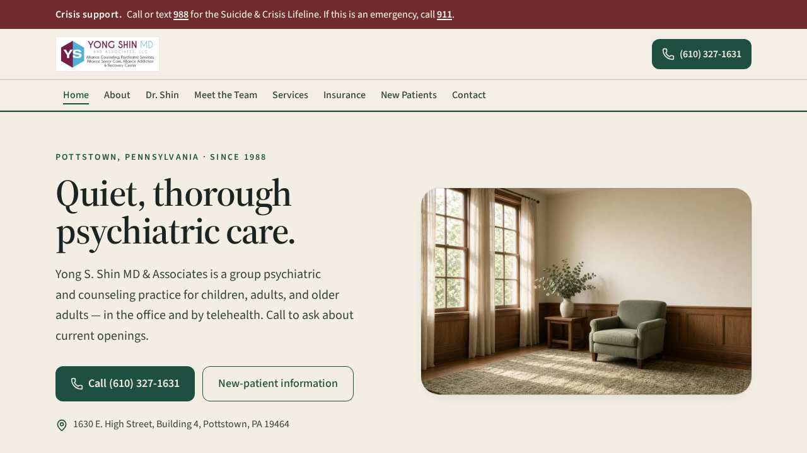

# Yong S. Shin MD & Associates

**Preview (live website):** [https://sysopx786.github.io/Website-Dr-Shin/](https://sysopx786.github.io/Website-Dr-Shin/)

**GitHub folder:** [https://github.com/sysopx786/Website-Dr-Shin](https://github.com/sysopx786/Website-Dr-Shin)

Open the **live preview** to see the public website. This GitHub folder is the source. Full list: [LINKS.md](LINKS.md).

Group psychiatric practice in Pottstown, Pennsylvania, since 1988. Evaluation, therapy, medication management, and specialty care — in the office and by telehealth.

---

## Links

### Preview & GitHub

- **Live preview:** [https://sysopx786.github.io/Website-Dr-Shin/](https://sysopx786.github.io/Website-Dr-Shin/)
- **This GitHub folder:** [https://github.com/sysopx786/Website-Dr-Shin](https://github.com/sysopx786/Website-Dr-Shin)
- **All relevant links:** [LINKS.md](https://github.com/sysopx786/Website-Dr-Shin/blob/main/LINKS.md)
- **GitHub Pages settings:** [Settings → Pages](https://github.com/sysopx786/Website-Dr-Shin/settings/pages)
- **Pages deploys:** [Actions](https://github.com/sysopx786/Website-Dr-Shin/actions)
- **Sitemap:** [sitemap.xml](https://sysopx786.github.io/Website-Dr-Shin/sitemap.xml)
- **robots.txt:** [robots.txt](https://sysopx786.github.io/Website-Dr-Shin/robots.txt)

### Practice

- **Name:** Yong S. Shin MD & Associates
- **Legal name:** Yong Shik Shin MD and Associates LLC
- **Address:** 1630 E. High Street, Building 4, Pottstown, PA 19464
- **Phone:** [(610) 327-1631](tel:+16103271631)
- **Fax:** (610) 327-1199
- **Email:** [info@yongshinmd.net](mailto:info@yongshinmd.net)
- **Hours:** Mon–Thu 9:00 a.m.–8:00 p.m. · Fri 9:00 a.m.–4:00 p.m. · Sat–Sun closed
- **Directions:** [Google Maps](https://www.google.com/maps/search/?api=1&query=1630+E+High+Street+Building+4+Pottstown+PA+19464)
- **Map:** [OpenStreetMap](https://www.openstreetmap.org/?mlat=40.2454&mlon=-75.611#map=17/40.2454/-75.611)
- **NPI:** 1881623338
- **PA license:** MD034368L
- **Crisis:** [988](tel:988) · Emergency [911](tel:911)

### Appointments

- **Schedule appointment:** Call [(610) 327-1631](tel:+16103271631)
- **Join a video visit:** [Doxy.me — click here at the time of your scheduled appointment](https://doxy.me/DrYShin)
- **View appointment:** [RXNT patient portal](https://app2.rxnt.com/phr/#)

Do not send diagnoses, medications, or other health details through this website or ordinary email.

### Pages on the live preview

| Section | Link |
|---|---|
| Home | [Preview](https://sysopx786.github.io/Website-Dr-Shin/) |
| About | [About](https://sysopx786.github.io/Website-Dr-Shin/about) |
| Dr. Shin credentials | [Dr. Shin](https://sysopx786.github.io/Website-Dr-Shin/dr-yong-shin) |
| Meet the Team | [Meet the Team](https://sysopx786.github.io/Website-Dr-Shin/meet-the-team) |
| Services | [Services](https://sysopx786.github.io/Website-Dr-Shin/services) |
| Insurance | [Insurance](https://sysopx786.github.io/Website-Dr-Shin/insurance) |
| New Patients | [New Patients](https://sysopx786.github.io/Website-Dr-Shin/new-patients) |
| Contact | [Contact](https://sysopx786.github.io/Website-Dr-Shin/contact) |
| Privacy | [Privacy](https://sysopx786.github.io/Website-Dr-Shin/privacy) |
| Terms of Service | [Terms](https://sysopx786.github.io/Website-Dr-Shin/terms) |
| Refunds | [Refunds](https://sysopx786.github.io/Website-Dr-Shin/refunds) |
| Cookies | [Cookies](https://sysopx786.github.io/Website-Dr-Shin/cookies) |
| Licenses | [Licenses](https://sysopx786.github.io/Website-Dr-Shin/licenses) |

---

## Stack

React 19, TanStack Start, Vite, Tailwind CSS v4. GitHub Pages is published from `main` via `.github/workflows/pages.yml` to the `gh-pages` branch.
